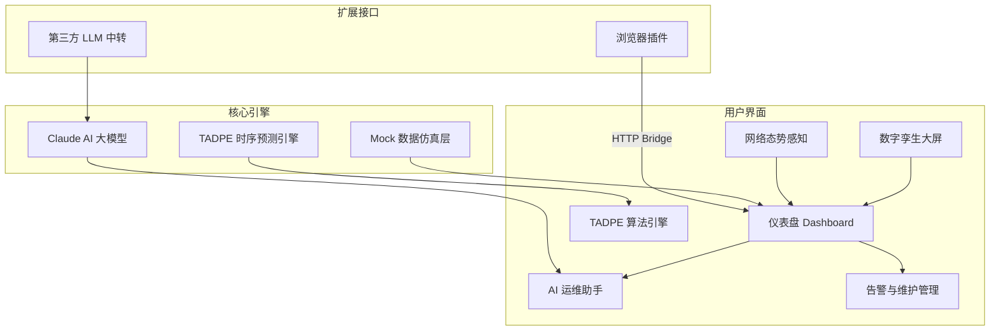

# 智瞳 Aura-PHM — 工业设备健康数字孪生平台

> 非标设备 5G+AI 预测性维护演示系统

## 项目定位

智瞳 Aura-PHM 是面向离散制造业的 **非标设备预测性维护** 解决方案演示平台。基于某制造厂气缸执行机构的真实运维场景，融合 5G 边缘计算、AI 大模型与数字孪生技术，实现设备退化趋势的提前预判与智能运维决策辅助。

## 系统架构



## 核心特性

- **智能预测**：TADPE 引擎（时序感知自适应退化预测）五阶段推理流水线，输出带置信区间的 RUL 估计
- **AI 运维助手**：接入 Claude 大模型，支持自然语言提问，自动关联设备上下文生成分析报告
- **数字孪生大屏**：3D WebGL 设备拓扑、区域对比、温压健康散点图，实时数据驱动
- **5G 网络态势感知**：实时延迟/丢包/吞吐监测 + 节点连接状态 + 安全事件时间线
- **离线优先**：无网络环境下所有功能可用，AI 助手自动降级为高质量离线回答
- **浏览器插件协同**：Chrome/Edge 插件抓取外部信息，推送至平台分析

## 快速开始

### 环境要求

- Node.js >= 18
- npm >= 9
- Windows 10/11（Electron 打包目标）

### 安装与运行

```bash
# 克隆项目
git clone <repository-url>
cd AI设备预测性维护

# 安装依赖
npm install

# 开发模式启动
npm run dev
```

### 配置 AI 助手（可选）

创建 `.env` 文件：

```env
ANTHROPIC_API_KEY=sk-ant-your-key
ANTHROPIC_BASE_URL=https://your-relay.com/v1   # 可选，第三方中转
ANTHROPIC_MODEL=claude-sonnet-4-20250514        # 可选，默认 claude-opus-4-8
```

未配置 API Key 时系统自动使用离线演示模式。

### 打包发布

```bash
npm run dist
```

输出 NSIS 安装包和 Portable 便携版至 `release/` 目录。

## 使用示例

### AI 运维助手预设问题

| 预设 | 功能 |
|------|------|
| 请分析当前最高风险气缸，并给出维修建议 | 生成详细风险报告 + 分级维修方案 |
| 请解释当前告警规则和触发原因 | 告警机制说明 + 当前触发详情 |
| 请根据当前告警生成班组交接摘要 | 结构化交接文档 |
| 请评估当前设备运行效率与产能影响 | OEE 分析 + 产能恢复路径 |

### TADPE 引擎演示

点击「启动引擎」观察五阶段推理过程：多尺度特征提取 → 时间注意力编码 → 物理约束正则化 → 保形概率预测 → 决策融合。

## 技术栈

| 类别 | 技术 |
|------|------|
| 桌面框架 | Electron 31 |
| 前端 | React 19 + TypeScript 5.7 |
| 可视化 | ECharts 5.6 + ECharts GL 2.1 |
| AI | Anthropic Claude API |
| 构建 | electron-vite 3 + Vite 6 |
| 打包 | electron-builder 25 |

## 许可证

MIT License
