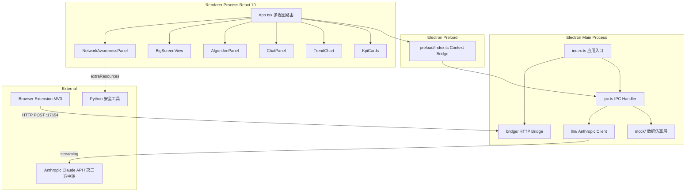
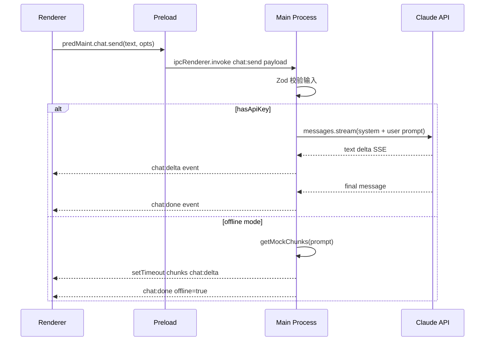

# 智瞳 Aura-PHM — 工业设备健康数字孪生平台

> 非标设备 5G+AI 预测性维护系统 · 完整技术文档

---

## 目录

- [项目概览](#项目概览)
- [系统架构](#系统架构)
- [环境搭建](#环境搭建)
- [模块详解](#模块详解)
- [配置参数](#配置参数)
- [API 与 IPC 通信](#api-与-ipc-通信)
- [数据模型](#数据模型)
- [部署与运维](#部署与运维)
- [浏览器插件](#浏览器插件)
- [安全工具集](#安全工具集)
- [常见问题](#常见问题)
- [开发与贡献指南](#开发与贡献指南)

---

## 项目概览

智瞳 Aura-PHM 是面向离散制造业非标设备的预测性维护演示平台，基于某制造厂气缸执行机构真实场景构建。系统融合 5G 边缘计算、大语言模型（LLM）、时序预测算法与 3D 数字孪生技术，实现设备退化的提前预判与智能运维辅助。

### 核心特性

- **TADPE 时序预测引擎**：五阶段推理流水线（特征提取 → 注意力编码 → 物理约束 → 保形预测 → 决策融合）
- **AI 运维助手**：Claude 大模型流式对话，自动注入设备上下文，输出 Markdown 格式分析报告
- **数字孪生大屏**：WebGL 3D 拓扑、区域对比、散点分析，实时数据驱动
- **5G 网络态势感知**：实时网络指标 + 节点连接状态 + 安全巡检工具链
- **离线优先设计**：全功能离线可用，AI 降级为高保真 mock 回答
- **浏览器插件协同**：Chrome/Edge MV3 插件通过本地 HTTP Bridge 推送外部信息

---

## 系统架构



### 进程通信模型



---

## 环境搭建

### 系统要求

| 项目 | 最低要求 |
|------|----------|
| OS | Windows 10 x64 / macOS 12+ / Linux (X11) |
| Node.js | >= 18.0.0 |
| npm | >= 9.0.0 |
| Python | >= 3.8（安全工具，可选） |
| 磁盘空间 | 源码 ~50MB，node_modules ~700MB |

### 安装

```bash
git clone <repository-url>
cd AI设备预测性维护
npm install
```

### 开发模式

```bash
npm run dev          # electron-vite dev, 支持 HMR
```

### 类型检查

```bash
npm run typecheck    # tsc --noEmit
```

### 生产构建

```bash
npm run build        # typecheck + electron-vite build
npm run dist         # build + electron-builder (NSIS + Portable)
```

---

## 模块详解

### 1. 主进程 (`src/main/`)

#### `index.ts` — 应用入口

- 创建 BrowserWindow（1440×920，最小 1080×720）
- 安全配置：`contextIsolation: true`, `nodeIntegration: false`, `sandbox: false`
- 注册 IPC handlers → 启动 Bridge Server

#### `ipc.ts` — IPC 通道注册

| 通道 | 方向 | 功能 |
|------|------|------|
| `dashboard:snapshot` | invoke | 获取仪表盘快照数据（KPI + 气缸 + 告警 + 维护记录） |
| `chat:send` | invoke | 发送聊天消息，返回 requestId |
| `chat:delta` | send | 流式文本片段推送 |
| `chat:done` | send | 聊天完成事件（含 token usage） |
| `chat:error` | send | 聊天错误事件 |
| `app:llm-status` | invoke | 获取 LLM 配置状态 |
| `extension:events` | invoke | 获取插件推送事件列表 |

所有 invoke payload 通过 Zod schema 校验。

#### `llm/anthropicClient.ts` — LLM 集成

- 支持环境变量配置：`ANTHROPIC_API_KEY`, `ANTHROPIC_BASE_URL`, `ANTHROPIC_MODEL`
- 在线模式：Claude API streaming + extended thinking (8000 budget tokens)
- 离线模式：关键词匹配的高保真 mock 回答（Markdown 表格/代码块/结构化报告）
- 错误处理：区分 AuthenticationError / RateLimitError / APIError

#### `llm/dashboardPrompt.ts` — Prompt 工程

- System Prompt：定义角色为「工业设备预测性维护 AI 分析师」
- User Prompt Builder：自动序列化当前仪表盘快照（气缸状态、告警列表、KPI）作为上下文

#### `mock/mockData.ts` — 数据仿真

- 6 台气缸设备，覆盖正常/漂移/临界/波动/恢复/脏数据六种运行模式
- 36 条时序记录（每台 6 条，跨 48 小时）
- 4 条告警记录 + 3 条维护记录
- 设备编号遵循工厂真实命名规范 (CSKG-LINE-STATION-FUNCTION)

#### `bridge/localBridgeServer.ts` — 插件 Bridge

- HTTP 服务监听 `127.0.0.1:17654`
- CORS 支持，Token 鉴权
- `POST /extension/ingest`：接收插件推送的页面信息
- `GET /ping`：健康检查

### 2. 预加载脚本 (`src/preload/`)

通过 `contextBridge.exposeInMainWorld('predMaint', api)` 暴露安全 API：

```typescript
interface PredMaintAPI {
  dashboard: {
    getSnapshot(): Promise<DashboardSnapshot>;
  };
  chat: {
    send(text: string, opts: ChatOpts): Promise<string>;
    onDelta(cb: (e: ChatDeltaEvent) => void): () => void;
    onDone(cb: (e: ChatDoneEvent) => void): () => void;
    onError(cb: (e: ChatErrorEvent) => void): () => void;
  };
  extension: {
    getEvents(): Promise<ExtensionEvent[]>;
  };
  app: {
    getLlmStatus(): Promise<LlmStatus>;
  };
}
```

### 3. 渲染进程 (`src/renderer/`)

#### 视图切换

App.tsx 内通过 `activeView` state 控制四个视图的显示/隐藏：

| 视图 | 组件 | 功能 |
|------|------|------|
| dashboard | 多组件组合 | 运维仪表盘 + AI 助手 |
| algorithm | AlgorithmPanel | TADPE 引擎可视化 |
| bigscreen | BigScreenView | 3D 数字孪生大屏 |
| security | NetworkAwarenessPanel | 网络态势感知 |

#### Dashboard 组件群

- **KpiCards**：5 个核心指标卡片（设备数/健康度/告警/待维护/数据质量）
- **TrendChart**：折线图展示气缸动作时间趋势，叠加基线/动态阈值/固定阈值
- **AlertDistributionChart**：饼图/环形图展示告警分布
- **RiskRankingChart**：横向柱状图按健康分排序
- **EquipmentHeatmap**：水平渐变柱状图，按工位展示健康状态
- **AlertsTable**：告警列表（支持两行文本截断 + title tooltip）
- **MaintenanceTable**：维护记录表
- **ChatPanel**：AI 助手（react-markdown 渲染，4 个快速预设）
- **ExtensionInbox**：插件消息收件箱

#### Algorithm 组件群

- **useAlgorithmSimulation**：核心 hook，驱动 5 阶段模拟（总时长 ~14s）
- **PipelineStages**：5 阶段流水线进度指示器
- **ConfidenceGauge**：仪表盘（置信度 + 故障概率）
- **DegradationChart**：退化趋势折线图（RUL/健康分/退化速率）
- **MetricsGrid**：6 宫格指标面板
- **AttentionHeatmap**：8×6 注意力权重热力图（20fps 动态动画）

#### BigScreen 组件群

- **BigScreenView**：三模式切换（全局拓扑/区域对比/设备散点）
- **useMockRealtimeData**：模拟实时数据 hook（3s 刷新周期）
- WebGL 渲染：ECharts GL scatter3D + graph layout + bar3D
- 粒子背景 Canvas 动画 + 鼠标视差

#### Security 组件群

- **NetworkAwarenessPanel**：
  - 3 个 MiniAreaChart（延迟/丢包/吞吐）
  - 6 节点连接状态网格
  - 安全事件时间线
  - 3 个安全巡检工具卡片 + 终端输出模拟

---

## 配置参数

### 环境变量 (`.env`)

| 变量名 | 必需 | 默认值 | 说明 |
|--------|------|--------|------|
| `ANTHROPIC_API_KEY` | 否 | — | Anthropic API Key，未设置则使用离线模式 |
| `ANTHROPIC_BASE_URL` | 否 | `https://api.anthropic.com` | 自定义 API 端点（支持第三方中转） |
| `ANTHROPIC_MODEL` | 否 | `claude-opus-4-8` | 模型 ID |
| `ELECTRON_BRIDGE_TOKEN` | 否 | — | 插件 Bridge 鉴权 Token |

### 构建配置 (`electron.vite.config.ts`)

```typescript
export default defineConfig({
  main: { build: { outDir: 'out/main' } },
  preload: { build: { outDir: 'out/preload', rollupOptions: { external: ['electron'] } } },
  renderer: { root: '.', build: { outDir: 'out/renderer', rollupOptions: { input: 'index.html' } } },
});
```

### 打包配置 (`package.json` → `build` 字段)

- AppId: `com.telecom.ai-predictive-maintenance`
- Target: NSIS (安装版) + Portable (免安装版)
- extraResources: `tools/` 目录打包为外部资源
- Architecture: x64 only

---

## API 与 IPC 通信

### Dashboard Snapshot 结构

```typescript
interface DashboardSnapshot {
  cylinders: CylinderStatus[];
  alerts: Alert[];
  maintenanceRecords: MaintenanceRecord[];
  kpi: DashboardKPI;
  timeSeries: TimeSeriesPoint[];
}
```

### Chat 请求/响应

```typescript
interface ChatRequest {
  requestId: string;
  userText: string;
  selectedCylinderUid?: string;
  includeSnapshot: boolean;
}

interface ChatDeltaEvent { requestId: string; delta: string; }
interface ChatDoneEvent { requestId: string; offline?: boolean; usage?: { inputTokens: number; outputTokens: number; }; }
interface ChatErrorEvent { requestId: string; message: string; code: string; }
```

### Extension Event

```typescript
interface ExtensionEvent {
  id: string;
  timestamp: string;
  source: string;
  title: string;
  url?: string;
  selectedText?: string;
}
```

---

## 数据模型

### 气缸设备 (CylinderStatus)

```typescript
interface CylinderStatus {
  uid: string;              // e.g. "CSKG-LA-ST01-PUSH-CYL01"
  name: string;             // 中文名称
  line: string;             // 产线编号
  station: string;          // 工位编号
  device: string;           // 设备编号
  baselineMs: number;       // 基线动作时间 (ms)
  fixedThreshold: number;   // 固定阈值 (baseline × 1.4)
  dynamicUpperMs: number;   // 动态上阈值
  latestMs: number;         // 最近一次动作时间
  healthScore: number;      // 健康评分 0-100
  faultProbability: number; // 故障概率 0-100
  alertLevel: 'normal' | 'info' | 'warning' | 'critical';
}
```

### 设备编号规范

```
CSKG - LA - ST01 - PUSH - CYL01
 │      │     │      │      │
 │      │     │      │      └── 气缸序号
 │      │     │      └── 功能 (PUSH/PULL/LIFT/CLAMP/ROTATE/LOCK)
 │      │     └── 工位号
 │      └── 产线 (LA/LB/LC/LD)
 └── 工厂代码
```

---

## 部署与运维

### 开发环境部署

```bash
npm install
npm run dev
```

### 生产打包

```bash
npm run dist
# 输出：release/<version>/AI预测性维护演示平台-<version>-Setup.exe
# 输出：release/<version>/AI预测性维护演示平台-<version>-Portable.exe
```

### 离线部署注意事项

- 系统默认为离线模式运行，无需任何网络配置
- AI 助手在离线模式下提供预置高保真回答
- 所有数据为本地 mock，不依赖外部数据库
- Python 安全工具打包在 `resources/tools/` 中

### 配置 LLM 在线模式

1. 创建 `.env` 文件于项目根目录
2. 设置 `ANTHROPIC_API_KEY`
3. 如使用第三方中转，设置 `ANTHROPIC_BASE_URL`
4. 重启应用

### 版本管理

| 版本 | 发布日期 | 主要变更 |
|------|----------|----------|
| v1.0.0 | 2026-06-09 | 初始版本，核心功能完整 |
| v2.0.0 | 2026-06-10 | 配色重构、动态热力图、LLM 中转、Markdown 渲染、网络可视化 |

---

## 浏览器插件

### 概述

Chrome/Edge 浏览器插件（Manifest V3），用于将外部网页信息推送至桌面平台。

### 安装

1. 打开 `chrome://extensions`
2. 启用「开发者模式」
3. 「加载已解压的扩展程序」→ 选择 `extension/` 目录

### 功能

- 捕获当前页面 Title + URL
- 捕获选中文本
- 通过 HTTP POST 推送至本地 Bridge (`127.0.0.1:17654/extension/ingest`)

### 通信协议

```http
POST /extension/ingest HTTP/1.1
Host: 127.0.0.1:17654
Content-Type: application/json

{
  "title": "Page Title",
  "url": "https://...",
  "selectedText": "selected content"
}
```

---

## 安全工具集

位于 `tools/` 目录，Python 实现，打包后位于 `resources/tools/`。

| 工具 | 文件 | 功能 |
|------|------|------|
| Nmap-Lite 端口扫描 | `scanner.py` | 多线程 TCP 端口扫描、Banner 抓取、OS 指纹、风险评估 |
| 网络拓扑侦测 | `cybereye.py` | 路由追踪、DNS 解析验证、可达性探测 |
| 数据通道安全评级 | `shieldscan.py` | TLS 证书检查、安全头合规评估、综合评分 |

### 运行要求

```bash
pip install rich
python tools/scanner.py --target 192.168.1.1 --ports top10
```

---

## 常见问题

### Q: 启动后白屏？

检查 Node.js 版本是否 >= 18。运行 `npm run build` 确认无 TypeScript 错误。

### Q: AI 助手一直显示"离线演示模式"？

未检测到 `ANTHROPIC_API_KEY` 环境变量。创建 `.env` 文件并填入有效 Key。

### Q: 如何使用第三方 API 中转？

在 `.env` 中设置 `ANTHROPIC_BASE_URL=https://your-proxy.com/v1`，中转服务需兼容 Anthropic Messages API。

### Q: 打包后体积太大？

Electron 打包的最小体积约 80MB（含 Chromium 运行时）。可通过 `electron-builder` 的 `asar` + `compression` 配置优化。

### Q: 如何添加新的气缸设备数据？

修改 `src/main/mock/mockData.ts` 中的 `CYLINDERS` 数组，遵循 UID 命名规范。

---

## 开发与贡献指南

### 项目结构约定

```
src/
├── main/          # Electron 主进程（Node.js 环境）
├── preload/       # 预加载脚本（受限 Node.js）
├── renderer/      # React 渲染进程（浏览器环境）
└── shared/        # 跨进程共享类型定义
```

### 代码规范

- TypeScript strict mode
- React 19 函数组件 + Hooks
- 无状态管理库（useState + prop drilling）
- ECharts 使用 dispose + init 模式管理实例
- IPC 输入一律使用 Zod 校验

### 新增视图流程

1. 在 `src/renderer/components/` 下创建组件目录
2. 在 `App.tsx` 的 view 切换逻辑中注册
3. 在 `NavBar.tsx` 中添加导航项
4. 如需主进程数据，在 `ipc.ts` 注册新 handler

### 新增 IPC 通道流程

1. `src/shared/types.ts`：定义请求/响应类型
2. `src/main/ipc.ts`：注册 handler + Zod schema
3. `src/preload/index.ts`：暴露到 renderer API
4. 渲染进程调用 `window.predMaint.xxx`

### 提交规范

```
feat: 新功能
fix: 修复
refactor: 重构
docs: 文档
style: 样式
```

---

## 许可证

MIT License
