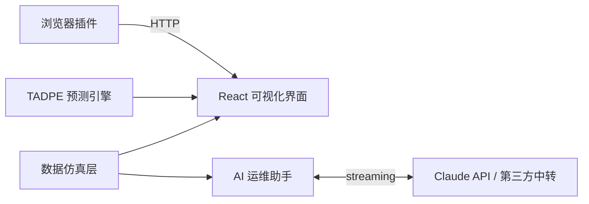
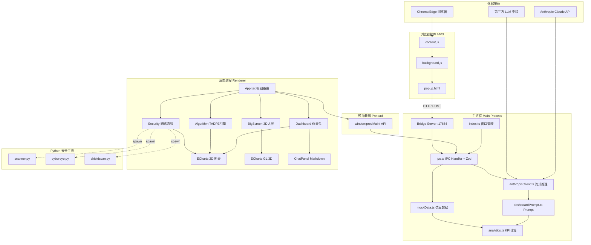
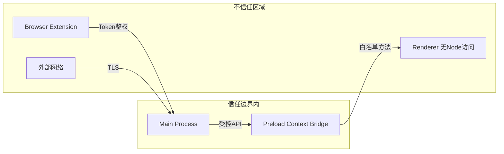
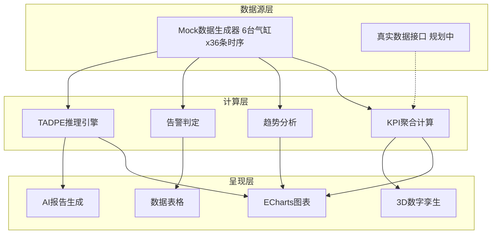
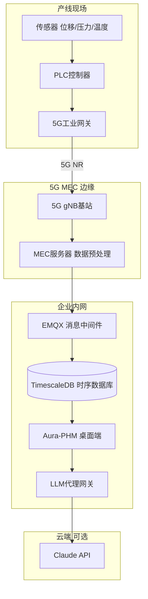
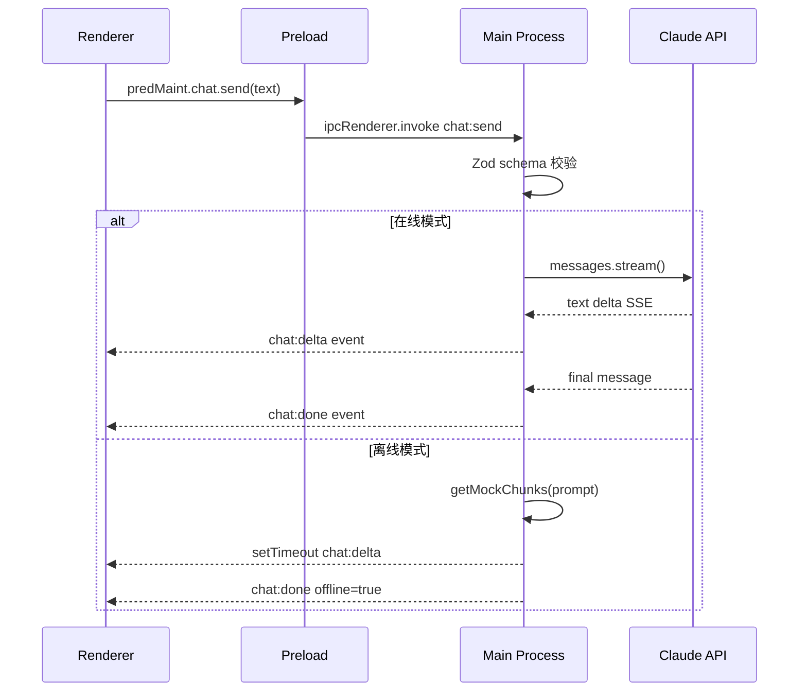

## 一、技术选型决策

### 1.1 桌面框架选型

| 方案 | 优势 | 劣势 | 结论 |
|------|------|------|------|
| **Electron** | Web 技术复用、生态丰富、3D/可视化支持好 | 体积大（~80MB）、内存占用较高 | ✅ 选用 |
| Tauri | 体积小（~5MB）、Rust 后端安全 | WebView 兼容性差、ECharts GL 支持未验证 | ❌ |
| Qt/C++ | 原生性能、体积可控 | 开发效率低、前端生态无法复用 | ❌ |

**决策理由**：项目核心是 3D 可视化 + AI 对话的富交互演示，Electron 的 Chromium 内核确保 WebGL/ECharts GL 完整支持，且团队 Web 技术栈可直接复用。

### 1.2 AI 服务选型

| 方案 | 优势 | 劣势 | 结论 |
|------|------|------|------|
| **Anthropic Claude** | Extended Thinking 能力强、流式输出、上下文窗口大 | 需海外 API/中转 | ✅ 选用 |
| OpenAI GPT-4 | 生态最广、Tool Use 成熟 | 国内访问受限 | 备选 |
| 本地 LLM (Ollama) | 完全离线、无 API 费用 | 推理质量不足、部署复杂 | 未来规划 |

**决策理由**：Claude 的 Extended Thinking 适合需要推理链的工业分析场景。通过 `baseURL` 配置支持第三方中转，兼容国内部署。离线 Mock 确保无 API 时可演示。

### 1.3 可视化选型

| 方案 | 优势 | 劣势 | 结论 |
|------|------|------|------|
| **ECharts + ECharts GL** | 图表类型丰富、3D 支持、中文文档 | 包体较大（~4MB） | ✅ 选用 |
| D3.js | 灵活度高、定制能力强 | 开发成本高、无内置 3D | ❌ |
| Three.js | 3D 能力最强 | 2D 图表需另选方案 | ❌ |
| Plotly | 统计图表方便 | 体积大、定制困难 | ❌ |

**决策理由**：ECharts 2D + GL 3D 统一生态，减少学习和集成成本。丰富的图表类型（热力图、仪表盘、力导向图、3D 散点）满足全部可视化需求。

### 1.4 构建工具选型

| 方案 | 优势 | 劣势 | 结论 |
|------|------|------|------|
| **electron-vite** | 原生支持 Electron 多入口、Vite HMR 极速 | 相对新 | ✅ 选用 |
| electron-forge + webpack | 官方推荐、成熟 | 配置复杂、HMR 慢 | ❌ |
| vite + 手动配置 | Vite 快 | 需手动处理 main/preload/renderer | ❌ |

---

## 二、V1 版架构图（简化版）

适用于快速理解系统核心组件和数据流向。

**说明**：
- 数据仿真层提供气缸设备的全量 Mock 数据
- AI 助手在线时调用 Claude API（支持中转），离线时使用本地预置回答
- TADPE 引擎在前端模拟运行，展示算法推理过程
- 浏览器插件通过本地 HTTP 将外部信息推送至应用

---

## 三、V2 版架构图（完整版）

展示完整模块关系、外部依赖、安全边界与扩展点。

---

### 安全边界说明

---

### 数据流架构

---

## 四、部署架构（生产规划）

---

## 五、IPC 通信时序图

---

*文档版本：v1.1 | 编制日期：2026-06-10*
